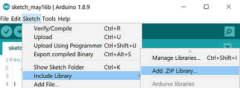

# moves-arduino
Implements basic motors moves for arduino based robots

# where to apply the project?
* In the amateur works
* In practice with libraries
* If you need to abstract from the logic of motor control
* For fun
# How to install library
### To install library you can use arduino ide menu

### or put this library folder to arduino library storage dirrectory 

# How to use library
### Just check the examples menu

